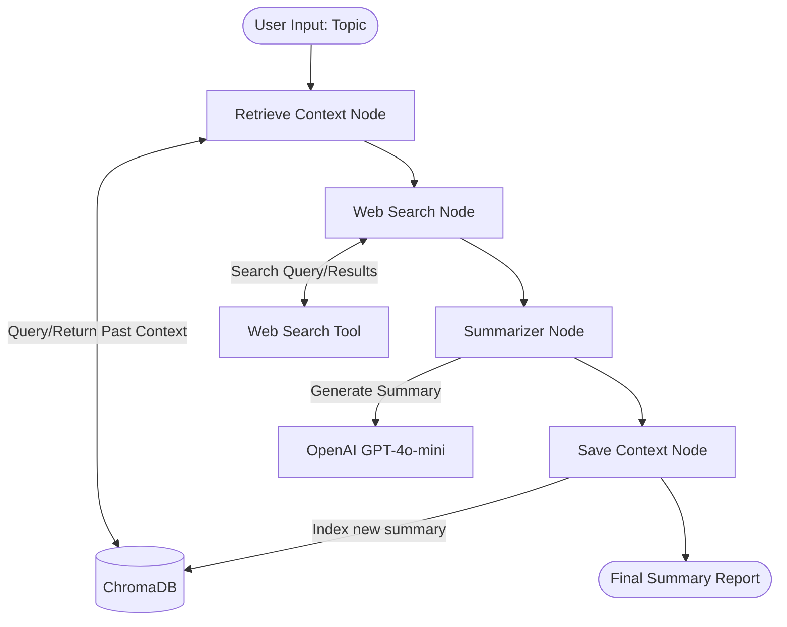

# Research & Summarization Agent

## Overview
This repository contains a **Research & Summarization Agent** built using LangChain and LangGraph. It is designed to perform multi-step tasks involving tool integration, data handling, and agentic reasoning to provide comprehensive research capabilities.

**The Problem it Solves:** 
When researching complex topics, analysts often need to find the latest information, synthesize it with prior research, and produce a concise summary. This agent automates that workflow:
1. **Retrieves** past historical context from a local vector database.
2. **Searches** the web for current, up-to-date information.
3. **Summarizes** the combined findings using an LLM.
4. **Saves** the newly generated context back into the vector database for long-term memory and future context (RAG).

## Architecture
The system is built on a state machine architecture defined by **LangGraph**, demonstrating how to move beyond simple sequential chains to robust, graph-based agentic workflows.



## Design Choices
- **LangGraph over Simple Chains**: Enables stateful, resilient multi-step workflows. Utilizing a `TypedDict` for `AgentState` ensures strict type safety as data flows between retrieval, execution, and synthesis nodes.
- **Local Vector Database (ChromaDB)**: Chosen for local, serverless operation without external infrastructure dependencies. It uses OpenAI embeddings (`text-embedding-3-small`) to provide long-term memory via Retrieval-Augmented Generation (RAG).
- **Modular Component Architecture**: Extensible design separates graph logic (`graph.py`, `nodes.py`) from external systems (`vector_store.py`, tools).

## Repository Structure
- `src/agents/`: Logic for the LangGraph state machine, nodes, and state definitions.
- `src/tools/`: Custom LangChain tool definitions (e.g., Web Searcher).
- `src/memory/`: Persistence logic and Vector DB integration (ChromaDB).
- `src/utils/`: Helpers for data cleaning, API management, etc.
- `data/`: Local storage directory for ChromaDB vector embeddings.
- `tests/`: Automated test suite using `pytest` and `unittest.mock`.
- `src/main.py`: Interactive CLI entry point.

## Setup & Execution

### 1. Prerequisites
Ensure you have Python 3.10+ installed.

### 2. Installation
Clone the repository and install the required dependencies:
```bash
python -m venv venv

.\venv\Scripts\activate

pip install -r requirements.txt
```

### 3. Environment Variables
Create a `.env` file from the provided template and add your API keys:
```bash
cp .env.example .env
```
Ensure you populate `OPENAI_API_KEY` to enable the LLM and Embedding models.

### 4. Running the Agent
Execute the main entry point to start the interactive workflow:
```bash
python src/main.py
```

### 5. Running Tests
To run the automated test suite and validate graph execution, use `pytest`:
```bash
python -m pytest tests/ -v
```