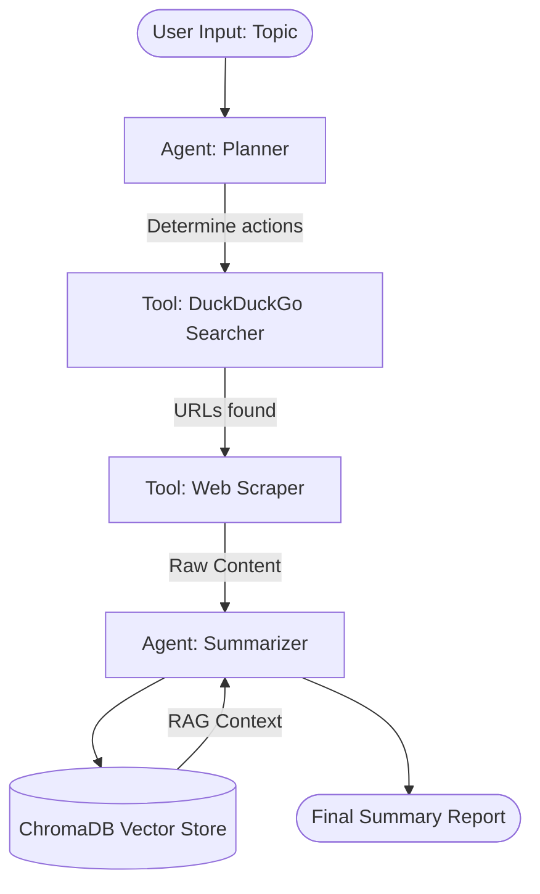

# LangChain
# Research & Summarization Agent

## Overview
This repository contains a **Research & Summarization Agent** built using LangChain and LangGraph. It is designed to perform a multi-step task involving tool integration, data handling, and agentic reasoning. 

**The Problem it Solves:** 
Provide a topic, and the agent autonomously:
1. Searches the web for current information.
2. Scrapes relevant URLs for detailed content.
3. Summarizes the findings.
4. Saves the context into a vector database (ChromaDB) for long-term memory and Retrieval-Augmented Generation (RAG).

## Architecture
The system is built on a state machine architecture defined by **LangGraph**, demonstrating how to move beyond simple sequential chains.



## Repository Structure
- `src/agents/`: Logic for different agent roles.
- `src/tools/`: Custom LangChain tool definitions (e.g., Web Searcher).
- `src/memory/`: Persistence logic and Vector DB integration.
- `src/utils/`: Helpers for data cleaning, API management, etc.
- `data/`: Sample data for RAG and testing purposes.
- `tests/`: Automated test suite using `pytest`.

## Setup & Execution

### 1. Prerequisites
Ensure you have Python 3.10+ installed.

### 2. Installation
Clone the repository and install the required dependencies:
```bash
python -m venv venv
# On Windows:
.\venv\Scripts\activate
# On Unix or MacOS:
source venv/bin/activate

pip install -r requirements.txt
```

### 3. Environment Variables
Create a `.env` file from the provided template and add your API keys:
```bash
cp .env.example .env
```
Ensure you populate `OPENAI_API_KEY` and any other required keys.

### 4. Running the Agent
Execute the main entry point to start the application:
```bash
python src/main.py
```

### 5. Running Tests
To run the automated test suite, use `pytest`:
```bash
pytest tests/
```